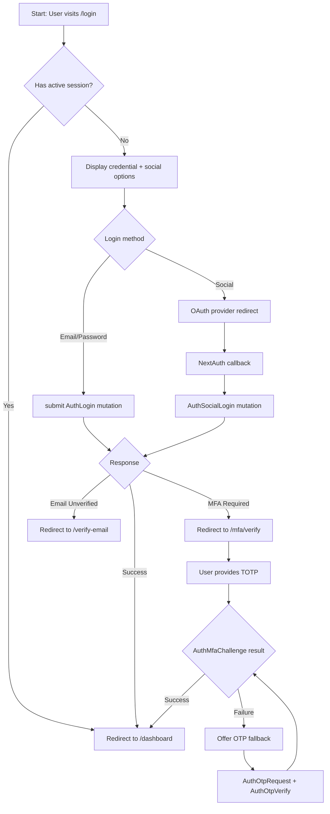
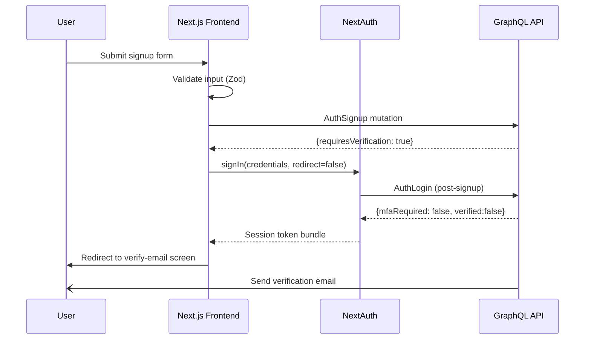
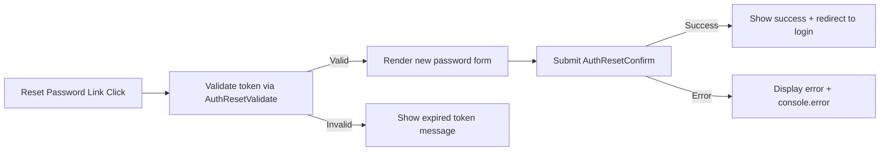
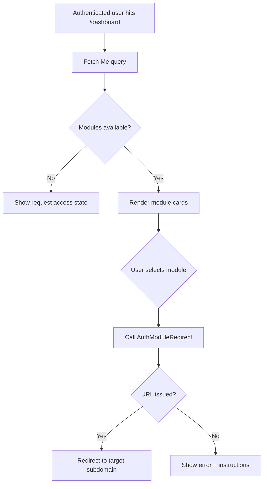

<!-- Mermaid diagrams describing Novo Auth flows -->

# Auth Module Flowcharts

All diagrams must stay aligned with the textual flow descriptions in `docs/auth/flows.md`. Update both files together when business logic changes.

